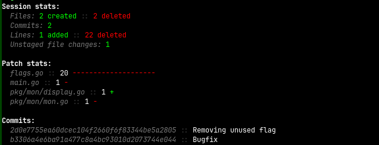
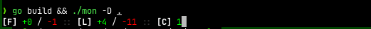

# mon

[](https://goreportcard.com/report/github.com/cneill/mon) [](https://pkg.go.dev/github.com/cneill/mon)

Monitor what AI coding agents are actually doing to your codebase.



## What is this?

`mon` watches your project directory in real time and tracks file changes, git commits, and dependency modifications
while AI coding agents (Claude, Cursor, Copilot, etc.) work on your code. When you're done, it gives you a summary of
everything that changed.

## Installation

**With Go:**

```bash
go install github.com/cneill/mon@latest
```

[**Or grab the latest release**](https://github.com/cneill/mon/releases/latest)

## Usage

Run `mon` in your project directory before starting your AI coding session:

```bash
mon /path/to/project
```

Or from within the project:

```bash
cd /path/to/project
mon .
```

Press `Ctrl+C` when done to see the session summary.

## What it tracks

| Category | Details |
|----------|---------|
| **Files** | Created, deleted, and write counts |
| **Git** | Commits, lines added/deleted, untracked changes |
| **Dependencies** | Added, removed, and version changes |

### Supported dependency files

- **Go** - `go.mod`
- **Node.js** - `package.json`
- **Python** - `requirements.txt`, `pyproject.toml`

## Audio

You can tell `mon` to play sounds on certain events like new commits, packages being added, files being written, etc.
with the `--audio` / `-A` flag. There are some default sounds, but you can also provide the paths to your own sounds for
various events in the `mon` configuration file, `~/.config/mon/config.json`, like so:

```json
{
  "audio": {
    "hooks": {
      "init": "[full_path]",
      "git_commit_create": "",
      "file_create": "",
      "file_remove": "",
      "file_write": "",
      "package_create": "",
      "package_remove": "",
      "package_upgrade": ""
    }
  }
}
```

## Screenshots

**While running:**



**Session summary (on exit):**


## Flags

```
--audio, -A      Play sounds based on events
--debug, -D      Write debug logs to mon_debug.log
--no-color, -C   Disable colored output
--all-files, -F  Show all file paths in final stats
--help, -h       Show help
--version, -v    Print version
```
